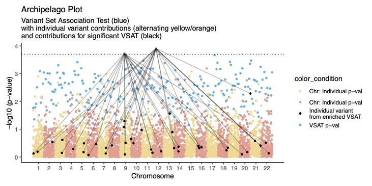

# Archipelago plot

## Summary and illustration of variant set association test statistics

Variant set association tests (VSAT), particularly those incorporating minor allele frequency variants, have become invaluable in genetic association studies by allowing robust statistical analysis with variant collapse. Unlike single variant tests, VSAT statistics cannot be assigned to a genomic coordinate for visual interpretation by default. To address these challenges, we introduce the Archipelago plot, a graphical method for interpreting both VSAT p-values and individual variant contributions. The Archipelago method assigns a meaningful genomic coordinate to the VSAT p-value, enabling its simultaneous visualization alongside individual variant p-values. This results in an intuitive and rich illustration akin to an archipelago of clustered islands, enhancing the understanding of both collective and individual impacts of variants. The Archipelago plot is applicable in any genetic association study that uses variant collapse to evaluate both individual variants and variant sets, and its customizability facilitates clear communication of complex genetic data. By integrating two dimensions of genetic data into a single visualization, VSAT results can be easily read and aid in identification of potential causal variants in variant sets such as protein pathways.




## How to
```R

# Install the package
install.packages("~/Library/Mobile Documents/com~apple~CloudDocs/post/manuscripts/manuscripts_epfl/archipelago_0.0.0.9000.tar.gz", repos = NULL, type = "source")

# install.packages("~/archipelago_0.0.0.9000.tar.gz", repos = NULL, type = "source")

# Load
library(archipelago)

# Load test data for df1 and df2
data("vsat_pval")
data("variant_pval")

# Import user data
# df1 <- read.csv(file="../data/vsat_pval.txt")
# df2 <- read.csv(file="../data/variant_pval.txt")

# Use default settings
archipelago_plot(df1, df2)

# 16 color themes:
# 'retro', 'metro', 'summer', 'messenger', 'sunset', 'alice', 'buckley', 'romance', 'meme', 'saiko', 'pagliacci', 'ambush', 'sunra', 'caliber', 'yawn', 'lawless'

archipelago_plot(df1,
                 df2,
                 color_theme = 'alice')

# Custom everything
output_path = "./archipelago_plot_custom_color.pdf"
output_raw = "./vsat_raw_plot.pdf"
color_labels <- c("Label_1", "Label_2" ,"Label_3","Label_4")
custom_colors = c("#9abfd8", "#cac1f3", "#371c4b", "#2a5b7f") # buckley theme colors
plot_title <- "Title"
plot_subtitle <- "Subtitle"
crit_val = .05/300 # P-value threshold line
point_size = .5 # geom_point size
output_path = "../output/archipelago_plot_custom_everything.pdf"
archipelago_plot(df1 = df1,
                 d = df2,
                 add_title = TRUE,
                 plot_title = plot_title,
                 add_subtitle = TRUE,
                 plot_subtitle = plot_subtitle,
                 show_legend = TRUE,
                 crit_val = crit_val,
                 point_size = point_size,
                 chr_ticks <- FALSE, # TRUE / FALSE
                 show_legend <- TRUE, # TRUE / FALSE
                 custom_colors = custom_colors,
                 color_labels = color_labels,
                 output_path = output_path
)
```

# Dev notes

## Set up
```
Rscript -e "usethis::create_package(getwd())"
```

## Docs with 
```
Rscript -e "devtools::document()"
```

## Build and install
```
Rscript -e "devtools::build()"
Rscript -e "devtools::install()"
```

## Install from zip in R
```
install.packages("/path/to/your/package/MyPackage.tar.gz", repos = NULL, type = "source")
```


